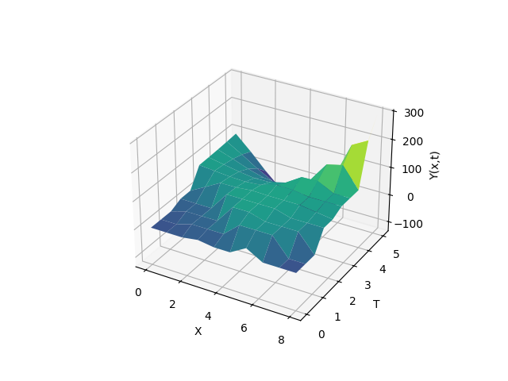

# Distributed-System-PDE-Modeler

## Description
The primary objective of this project was to develop a robust computer implementation of a mathematical model for a dynamical system with distributed parameters. The application provides an automated pipeline to process specific types of initial and boundary conditions, alongside given modeling functions ($u_0$, $u_\Gamma$), to numerically and symbolically solve partial differential equations (PDEs), such as the 1D wave equation. The application seamlessly integrates a C# Windows Forms graphical interface for user input with a powerful Python backend that handles complex symbolic mathematics, Green's function integrations, and pseudo-inverse matrix calculations to find continuous approximate solutions and evaluate their accuracy against exact mathematical models.
The project eliminates the tedious process of manual Green's function integrations by automating the symbolic calculations, making it easier to analyze complex dynamical systems dynamically.

### Technologies Used
* **C# (.NET WinForms)** — utilized for building the interactive graphical user interface (GUI), collecting dynamic user inputs, and managing cross-process execution.
* **Python** — backend computation language.
* **SymPy** — applied for heavy symbolic mathematics, including parsing string formulas, analytical integration, and manipulating Green's functions and Heaviside step functions.
* **NumPy & SciPy** — used for efficient numerical grid generation and complex matrix evaluations.
* **Matplotlib** — utilized for rendering high-quality 3D surface plots to visualize the wave dynamics.

### Results
The program successfully establishes a bridge between a desktop UI and a computational Python engine. It automatically parses user-defined initial and boundary conditions from the GUI via text files (`input.txt`), processes them symbolically in the backend to compute the state of the system over space and time, and outputs the exact analytical mathematical expressions (`output.txt`). The computational output confirms the system's stability and its ability to accurately model wave propagation.

### Visualization
The pipeline automatically generates 3D surface plots to visually demonstrate the mathematical model's behavior over the defined spatial ($x$) and temporal ($t$) grid.

<p align="center">
  <b>System State (Wave Propagation)</b><br><br>
  <br><br>
  <sub>Visualizing the spatial-temporal dynamics of the system</sub>
</p>

## Quick Start Guide

### 1. Download the Project
Clone or download the repository containing both the C# source files and the Python backend scripts (`script.py`, `plot.py`) to your local machine.

### 2. Install Python Dependencies
The backend requires specific mathematical and plotting libraries. Ensure you have Python 3.8 or higher installed, then open your terminal or command prompt and execute:
```bash
pip install sympy numpy scipy matplotlib
```
### 3. Build and Execute the Application

1. **Open the project** in Visual Studio and compile the C# Windows Forms application.
2. **Install Python Dependencies**
  The backend requires specific mathematical and plotting libraries. Ensure you have Python 3.8 or higher installed, then open your terminal or command prompt and execute:
```bash
pip install sympy numpy scipy matplotlib
```
3. **Launch** the generated executable.
4. **Enter your system parameters** (`a`, `b`, `c`, `T`), as well as your initial and boundary conditions, into the graphical interface.
5. **Click the calculation button.** The C# application will automatically invoke the Python scripts to perform the symbolic computations and render the 3D analytical plots.
